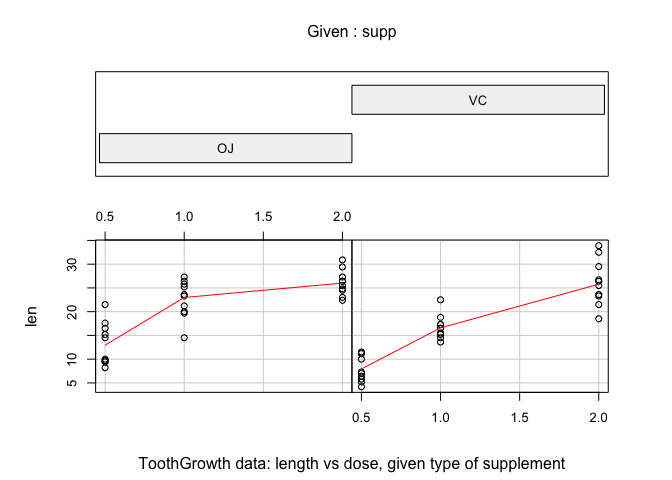

<!--
    https://rstudio-pubs-static.s3.amazonaws.com/35364_334944a02fcf4792b232aacbfee2f6e6.html
    https://rpubs.com/roozbehdavari/33121
-->
# Assessing the ToothGrowth Dataset with R
#### Author: Danilo Mutti


The [ToothGrowth dataset](https://stat.ethz.ch/R-manual/R-devel/library/datasets/html/ToothGrowth.html) (TG) contains data about the effect of vitamin C on tooth growth in Guinea pigs. In this study, the response is the length of odontoblasts (teeth) in each of 10 guinea pigs at each of three dose levels of Vitamin C (0.5, 1, and 2 mg) with each of two delivery methods (orange juice or ascorbic acid).

The dataset contains a data frame with 60 observations on 3 variables.

|column index|column name| type      | description |
|------------|-----------|-----------|-------------|
| [,1]       | len	     | numeric	 |Tooth length |
| [,2]       | supp	     | factor    | Supplement type (VC or OJ).|
| [,3]       | dose      | numeric   | Dose in milligrams.|

We start by loading the dataset, followed by a basic exploration of how the data is structured.


```r
data(ToothGrowth)
str(ToothGrowth)
```

```
## 'data.frame':	60 obs. of  3 variables:
##  $ len : num  4.2 11.5 7.3 5.8 6.4 10 11.2 11.2 5.2 7 ...
##  $ supp: Factor w/ 2 levels "OJ","VC": 2 2 2 2 2 2 2 2 2 2 ...
##  $ dose: num  0.5 0.5 0.5 0.5 0.5 0.5 0.5 0.5 0.5 0.5 ...
```

```r
summary(ToothGrowth)
```

```
##       len        supp         dose      
##  Min.   : 4.20   OJ:30   Min.   :0.500  
##  1st Qu.:13.07   VC:30   1st Qu.:0.500  
##  Median :19.25           Median :1.000  
##  Mean   :18.81           Mean   :1.167  
##  3rd Qu.:25.27           3rd Qu.:2.000  
##  Max.   :33.90           Max.   :2.000
```

The following figure *seems to indicate* that orange juice (OJ) is more effective for lower/intermediate dose levels. When dose levels are higher, the effectiveness between OJ and Vitamin C (VC) *seems to be similar*, with OJ presenting more consistent results.


```r
coplot(len ~ dose | supp, data = ToothGrowth, panel = panel.smooth,
       xlab = "ToothGrowth data: length vs dose, given type of supplement")
```

 

## Appendix

This section contains the environment in which this report was produced.


```r
sessionInfo()
```

```
## R version 3.1.2 (2014-10-31)
## Platform: x86_64-apple-darwin13.4.0 (64-bit)
## 
## locale:
## [1] C
## 
## attached base packages:
## [1] stats     graphics  grDevices utils     datasets  methods   base     
## 
## other attached packages:
## [1] dplyr_0.3.0.2 ggplot2_1.0.0
## 
## loaded via a namespace (and not attached):
##  [1] DBI_0.3.1        MASS_7.3-35      Rcpp_0.11.3      assertthat_0.1  
##  [5] colorspace_1.2-4 digest_0.6.6     evaluate_0.5.5   formatR_1.0     
##  [9] grid_3.1.2       gtable_0.1.2     htmltools_0.2.6  knitr_1.9       
## [13] magrittr_1.5     munsell_0.4.2    parallel_3.1.2   plyr_1.8.1      
## [17] proto_0.3-10     reshape2_1.4.1   rmarkdown_0.3.10 scales_0.2.4    
## [21] stringr_0.6.2    tools_3.1.2      yaml_2.1.13
```
