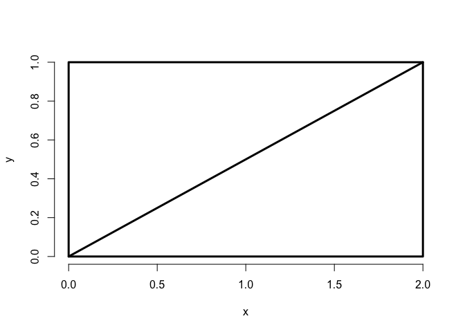
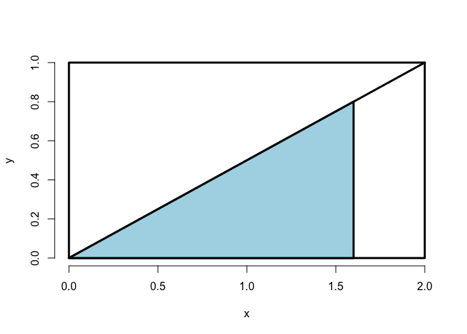

# Probability 2

[Source](https://github.com/swirldev/swirl_courses/blob/master/Statistical_Inference/Probability2)


Recall that a random variable is a numerical outcome of an experiment. It can be discrete (take on only a countable number of possibilities), or continuous (take on any value on the real line or subset of it).

If you had a ruler of infinite precision, would measuring the height of adults around the world be continuous or discrete?

* `1: continuous`
* 2: discrete

Is the drawing of a hand of cards continuous or discrete?

* 1: continuous
* `2: discrete`

Continuous random variables are usually associated with measurements of time, distance, or some biological process since they can take on any value, often within some specified range.
Limitations of precision in taking the measurements may imply that the values are discrete; we in fact consider them continuous.

A probability mass function (PMF) gives the probability that a discrete random variable is exactly equal to some value.

For instance, suppose we have a coin which may or may not be fair. Let x=0 represent a 'heads' outcome and x=1 represent a 'tails' outcome of a coin toss. If p is the probability of 'heads' which of the following represents the PMF of the coin toss?  The variable x is either 0 (heads) or 1 (tails).

* `1: (p^(1-x))*(1-p)^x`
* 2: (p^x)*(1-p)^(1-x)

A probability density function is associated with a continuous random variable. To quote from Wikipedia, it "is a function that describes the relative likelihood for this random variable to take on a given value. The probability of the random variable falling within a particular range of values is given by ... the area under the density function but above the horizontal axis and between the lowest and greatest values of the range."

We'll repeat two requirements of a probability density function. It must be nonnegative everywhere, and the area under it must equal one."

Consider this figure - a rectangle with height 1 and width 2 with a diagonal line drawn from the lower left corner (0,0) to the upper right (2,1). The area of the entire rectangle is 2 and elementary geometry tells us that the diagonal divides the rectangle into 2 equal areas.


```r
x <- c(0,2,2,0,0)
y <- c(0,0,1,1,0)
plot(x, y, lwd = 3, frame = FALSE, type = "l")
segments(0,0,2,1,lwd=3)
```

 

Could the diagonal line represent a probability density function for a random variable with a range of values between 0 and 2? Assume the lower side of the rectangle is the x axis.

* `1: Yes`
2: No

Now consider the shaded portion of the triangle - a smaller triangle with a base of length 1.6 and height determined by the diagonal. We'll answer the question, "What proportion of the big triangle is shaded?"


```r
plot(x, y, lwd = 3, frame = FALSE, type = "l")
segments(0,0,2,1,lwd=3)
polygon(c(0,1.6,1.6,0),c(0,0,.8,0),lwd=3,col="lightblue")
```

 

```r
mypdf <- function(x){x/2}
```

This proportion represents the probability that throwing a piece of cat kibble at the bigger triangle (below the diagonal) hits the blue portion.

We have to compute the area of the blue triangle. (Since the area of the big triangle is 1, the area of the blue triangle is the proportion of the big triangle that is shaded.) We know the base, but what is its height?

* `1: .8`
* 2: I can't tell
* 3: .5
* 4: .25

What is the area of the blue triangle?


```r
(1.6*.8)/2
```

```
## [1] 0.64
```

So, what is the probability that the kibble we throw at the bigger triangle will hit the blue portion?


```r
.64
```

```
## [1] 0.64
```

This artificial example was to meant to illustrate a simple probability density function (PDF). Most PDF's have underlying formulae more complicated than lines. We'll see more of these in future lessons.

The cumulative distribution function (CDF) of a random variable X, either discrete or continuous, is the function F(x) equal to the probability that X is less than or equal to x. In the example above, the area of the blue triangle represents the probability that the random variable was less than or equal to the value 1.6.

In the triangle example from above, which of the following expressions represents F(x), the CDF?

(The term 'x' is the base, x/2 is the height.  Plug these into the formula for the area of a triangle.)

* 1: x*x/2
* 2: x^2
* 3: x*2x/2
* `4: x*x/4`

If you're familiar with calculus you might recognize that when you're computing areas under curves you're actually integrating functions.

When the random variable is continuous, as in the example, the PDF is the derivative of the CDF. So integrating the PDF (the line represented by the diagonal) yields the CDF. When you evaluate the CDF at the limits of integration the result is an area.

To see this in the example, we've defined the function mypdf for you. This is the equation of the line represented by the diagonal of the rectangle. As the PDF, it is the derivative of F(x), the CDF. Look at mypdf now.


```r
mypdf <- function(x){x/2}
```

Now use the R function integrate to integrate mypdf with the parameters lower equal to 0 and upper equal to 1.6. See if you get the same area (probability) you got before.


```r
integrate(mypdf, 0, 1.6)
```

```
## 0.64 with absolute error < 7.1e-15
```
